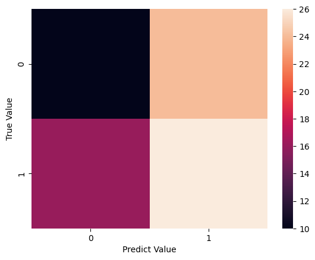

# Import Libraries 


```python
import pandas as pd
import numpy as np 
import matplotlib.pyplot as plt
import pylab as pl 
import seaborn as sns
```

# Load Data


```python
df  = pd.read_csv("heart.csv")
```


```python
df
```


<div>
<style scoped>
    .dataframe tbody tr th:only-of-type {
        vertical-align: middle;
    }

    .dataframe tbody tr th {
        vertical-align: top;
    }

    .dataframe thead th {
        text-align: right;
    }
</style>
<table border="1" class="dataframe">
  <thead>
    <tr style="text-align: right;">
      <th></th>
      <th>age</th>
      <th>sex</th>
      <th>cp</th>
      <th>trestbps</th>
      <th>chol</th>
      <th>fbs</th>
      <th>restecg</th>
      <th>thalach</th>
      <th>exang</th>
      <th>oldpeak</th>
      <th>slope</th>
      <th>ca</th>
      <th>thal</th>
      <th>target</th>
    </tr>
  </thead>
  <tbody>
    <tr>
      <th>0</th>
      <td>63</td>
      <td>1</td>
      <td>3</td>
      <td>145</td>
      <td>233</td>
      <td>1</td>
      <td>0</td>
      <td>150</td>
      <td>0</td>
      <td>2.3</td>
      <td>0</td>
      <td>0</td>
      <td>1</td>
      <td>1</td>
    </tr>
    <tr>
      <th>1</th>
      <td>37</td>
      <td>1</td>
      <td>2</td>
      <td>130</td>
      <td>250</td>
      <td>0</td>
      <td>1</td>
      <td>187</td>
      <td>0</td>
      <td>3.5</td>
      <td>0</td>
      <td>0</td>
      <td>2</td>
      <td>1</td>
    </tr>
    <tr>
      <th>2</th>
      <td>41</td>
      <td>0</td>
      <td>1</td>
      <td>130</td>
      <td>204</td>
      <td>0</td>
      <td>0</td>
      <td>172</td>
      <td>0</td>
      <td>1.4</td>
      <td>2</td>
      <td>0</td>
      <td>2</td>
      <td>1</td>
    </tr>
    <tr>
      <th>3</th>
      <td>56</td>
      <td>1</td>
      <td>1</td>
      <td>120</td>
      <td>236</td>
      <td>0</td>
      <td>1</td>
      <td>178</td>
      <td>0</td>
      <td>0.8</td>
      <td>2</td>
      <td>0</td>
      <td>2</td>
      <td>1</td>
    </tr>
    <tr>
      <th>4</th>
      <td>57</td>
      <td>0</td>
      <td>0</td>
      <td>120</td>
      <td>354</td>
      <td>0</td>
      <td>1</td>
      <td>163</td>
      <td>1</td>
      <td>0.6</td>
      <td>2</td>
      <td>0</td>
      <td>2</td>
      <td>1</td>
    </tr>
    <tr>
      <th>...</th>
      <td>...</td>
      <td>...</td>
      <td>...</td>
      <td>...</td>
      <td>...</td>
      <td>...</td>
      <td>...</td>
      <td>...</td>
      <td>...</td>
      <td>...</td>
      <td>...</td>
      <td>...</td>
      <td>...</td>
      <td>...</td>
    </tr>
    <tr>
      <th>298</th>
      <td>57</td>
      <td>0</td>
      <td>0</td>
      <td>140</td>
      <td>241</td>
      <td>0</td>
      <td>1</td>
      <td>123</td>
      <td>1</td>
      <td>0.2</td>
      <td>1</td>
      <td>0</td>
      <td>3</td>
      <td>0</td>
    </tr>
    <tr>
      <th>299</th>
      <td>45</td>
      <td>1</td>
      <td>3</td>
      <td>110</td>
      <td>264</td>
      <td>0</td>
      <td>1</td>
      <td>132</td>
      <td>0</td>
      <td>1.2</td>
      <td>1</td>
      <td>0</td>
      <td>3</td>
      <td>0</td>
    </tr>
    <tr>
      <th>300</th>
      <td>68</td>
      <td>1</td>
      <td>0</td>
      <td>144</td>
      <td>193</td>
      <td>1</td>
      <td>1</td>
      <td>141</td>
      <td>0</td>
      <td>3.4</td>
      <td>1</td>
      <td>2</td>
      <td>3</td>
      <td>0</td>
    </tr>
    <tr>
      <th>301</th>
      <td>57</td>
      <td>1</td>
      <td>0</td>
      <td>130</td>
      <td>131</td>
      <td>0</td>
      <td>1</td>
      <td>115</td>
      <td>1</td>
      <td>1.2</td>
      <td>1</td>
      <td>1</td>
      <td>3</td>
      <td>0</td>
    </tr>
    <tr>
      <th>302</th>
      <td>57</td>
      <td>0</td>
      <td>1</td>
      <td>130</td>
      <td>236</td>
      <td>0</td>
      <td>0</td>
      <td>174</td>
      <td>0</td>
      <td>0.0</td>
      <td>1</td>
      <td>1</td>
      <td>2</td>
      <td>0</td>
    </tr>
  </tbody>
</table>
<p>303 rows × 14 columns</p>
</div>


# EDA


```python
sns.pairplot(df , hue='target')
plt.show()
```

    C:\Users\motal\anaconda3\Lib\site-packages\seaborn\axisgrid.py:118: UserWarning: The figure layout has changed to tight
      self._figure.tight_layout(*args, **kwargs)
    


    

    


```python
Data_Correlation = df.corr()
```


```python
Data_Correlation
```


<div>
<style scoped>
    .dataframe tbody tr th:only-of-type {
        vertical-align: middle;
    }

    .dataframe tbody tr th {
        vertical-align: top;
    }

    .dataframe thead th {
        text-align: right;
    }
</style>
<table border="1" class="dataframe">
  <thead>
    <tr style="text-align: right;">
      <th></th>
      <th>age</th>
      <th>sex</th>
      <th>cp</th>
      <th>trestbps</th>
      <th>chol</th>
      <th>fbs</th>
      <th>restecg</th>
      <th>thalach</th>
      <th>exang</th>
      <th>oldpeak</th>
      <th>slope</th>
      <th>ca</th>
      <th>thal</th>
      <th>target</th>
    </tr>
  </thead>
  <tbody>
    <tr>
      <th>age</th>
      <td>1.000000</td>
      <td>-0.098447</td>
      <td>-0.068653</td>
      <td>0.279351</td>
      <td>0.213678</td>
      <td>0.121308</td>
      <td>-0.116211</td>
      <td>-0.398522</td>
      <td>0.096801</td>
      <td>0.210013</td>
      <td>-0.168814</td>
      <td>0.276326</td>
      <td>0.068001</td>
      <td>-0.225439</td>
    </tr>
    <tr>
      <th>sex</th>
      <td>-0.098447</td>
      <td>1.000000</td>
      <td>-0.049353</td>
      <td>-0.056769</td>
      <td>-0.197912</td>
      <td>0.045032</td>
      <td>-0.058196</td>
      <td>-0.044020</td>
      <td>0.141664</td>
      <td>0.096093</td>
      <td>-0.030711</td>
      <td>0.118261</td>
      <td>0.210041</td>
      <td>-0.280937</td>
    </tr>
    <tr>
      <th>cp</th>
      <td>-0.068653</td>
      <td>-0.049353</td>
      <td>1.000000</td>
      <td>0.047608</td>
      <td>-0.076904</td>
      <td>0.094444</td>
      <td>0.044421</td>
      <td>0.295762</td>
      <td>-0.394280</td>
      <td>-0.149230</td>
      <td>0.119717</td>
      <td>-0.181053</td>
      <td>-0.161736</td>
      <td>0.433798</td>
    </tr>
    <tr>
      <th>trestbps</th>
      <td>0.279351</td>
      <td>-0.056769</td>
      <td>0.047608</td>
      <td>1.000000</td>
      <td>0.123174</td>
      <td>0.177531</td>
      <td>-0.114103</td>
      <td>-0.046698</td>
      <td>0.067616</td>
      <td>0.193216</td>
      <td>-0.121475</td>
      <td>0.101389</td>
      <td>0.062210</td>
      <td>-0.144931</td>
    </tr>
    <tr>
      <th>chol</th>
      <td>0.213678</td>
      <td>-0.197912</td>
      <td>-0.076904</td>
      <td>0.123174</td>
      <td>1.000000</td>
      <td>0.013294</td>
      <td>-0.151040</td>
      <td>-0.009940</td>
      <td>0.067023</td>
      <td>0.053952</td>
      <td>-0.004038</td>
      <td>0.070511</td>
      <td>0.098803</td>
      <td>-0.085239</td>
    </tr>
    <tr>
      <th>fbs</th>
      <td>0.121308</td>
      <td>0.045032</td>
      <td>0.094444</td>
      <td>0.177531</td>
      <td>0.013294</td>
      <td>1.000000</td>
      <td>-0.084189</td>
      <td>-0.008567</td>
      <td>0.025665</td>
      <td>0.005747</td>
      <td>-0.059894</td>
      <td>0.137979</td>
      <td>-0.032019</td>
      <td>-0.028046</td>
    </tr>
    <tr>
      <th>restecg</th>
      <td>-0.116211</td>
      <td>-0.058196</td>
      <td>0.044421</td>
      <td>-0.114103</td>
      <td>-0.151040</td>
      <td>-0.084189</td>
      <td>1.000000</td>
      <td>0.044123</td>
      <td>-0.070733</td>
      <td>-0.058770</td>
      <td>0.093045</td>
      <td>-0.072042</td>
      <td>-0.011981</td>
      <td>0.137230</td>
    </tr>
    <tr>
      <th>thalach</th>
      <td>-0.398522</td>
      <td>-0.044020</td>
      <td>0.295762</td>
      <td>-0.046698</td>
      <td>-0.009940</td>
      <td>-0.008567</td>
      <td>0.044123</td>
      <td>1.000000</td>
      <td>-0.378812</td>
      <td>-0.344187</td>
      <td>0.386784</td>
      <td>-0.213177</td>
      <td>-0.096439</td>
      <td>0.421741</td>
    </tr>
    <tr>
      <th>exang</th>
      <td>0.096801</td>
      <td>0.141664</td>
      <td>-0.394280</td>
      <td>0.067616</td>
      <td>0.067023</td>
      <td>0.025665</td>
      <td>-0.070733</td>
      <td>-0.378812</td>
      <td>1.000000</td>
      <td>0.288223</td>
      <td>-0.257748</td>
      <td>0.115739</td>
      <td>0.206754</td>
      <td>-0.436757</td>
    </tr>
    <tr>
      <th>oldpeak</th>
      <td>0.210013</td>
      <td>0.096093</td>
      <td>-0.149230</td>
      <td>0.193216</td>
      <td>0.053952</td>
      <td>0.005747</td>
      <td>-0.058770</td>
      <td>-0.344187</td>
      <td>0.288223</td>
      <td>1.000000</td>
      <td>-0.577537</td>
      <td>0.222682</td>
      <td>0.210244</td>
      <td>-0.430696</td>
    </tr>
    <tr>
      <th>slope</th>
      <td>-0.168814</td>
      <td>-0.030711</td>
      <td>0.119717</td>
      <td>-0.121475</td>
      <td>-0.004038</td>
      <td>-0.059894</td>
      <td>0.093045</td>
      <td>0.386784</td>
      <td>-0.257748</td>
      <td>-0.577537</td>
      <td>1.000000</td>
      <td>-0.080155</td>
      <td>-0.104764</td>
      <td>0.345877</td>
    </tr>
    <tr>
      <th>ca</th>
      <td>0.276326</td>
      <td>0.118261</td>
      <td>-0.181053</td>
      <td>0.101389</td>
      <td>0.070511</td>
      <td>0.137979</td>
      <td>-0.072042</td>
      <td>-0.213177</td>
      <td>0.115739</td>
      <td>0.222682</td>
      <td>-0.080155</td>
      <td>1.000000</td>
      <td>0.151832</td>
      <td>-0.391724</td>
    </tr>
    <tr>
      <th>thal</th>
      <td>0.068001</td>
      <td>0.210041</td>
      <td>-0.161736</td>
      <td>0.062210</td>
      <td>0.098803</td>
      <td>-0.032019</td>
      <td>-0.011981</td>
      <td>-0.096439</td>
      <td>0.206754</td>
      <td>0.210244</td>
      <td>-0.104764</td>
      <td>0.151832</td>
      <td>1.000000</td>
      <td>-0.344029</td>
    </tr>
    <tr>
      <th>target</th>
      <td>-0.225439</td>
      <td>-0.280937</td>
      <td>0.433798</td>
      <td>-0.144931</td>
      <td>-0.085239</td>
      <td>-0.028046</td>
      <td>0.137230</td>
      <td>0.421741</td>
      <td>-0.436757</td>
      <td>-0.430696</td>
      <td>0.345877</td>
      <td>-0.391724</td>
      <td>-0.344029</td>
      <td>1.000000</td>
    </tr>
  </tbody>
</table>
</div>


Visualize it 


```python
sns.heatmap(Data_Correlation)
```


    <Axes: >


    

    


```python
x= df.iloc[: , :-1]
```


```python
x
```


<div>
<style scoped>
    .dataframe tbody tr th:only-of-type {
        vertical-align: middle;
    }

    .dataframe tbody tr th {
        vertical-align: top;
    }

    .dataframe thead th {
        text-align: right;
    }
</style>
<table border="1" class="dataframe">
  <thead>
    <tr style="text-align: right;">
      <th></th>
      <th>age</th>
      <th>sex</th>
      <th>cp</th>
      <th>trestbps</th>
      <th>chol</th>
      <th>fbs</th>
      <th>restecg</th>
      <th>thalach</th>
      <th>exang</th>
      <th>oldpeak</th>
      <th>slope</th>
      <th>ca</th>
      <th>thal</th>
    </tr>
  </thead>
  <tbody>
    <tr>
      <th>0</th>
      <td>63</td>
      <td>1</td>
      <td>3</td>
      <td>145</td>
      <td>233</td>
      <td>1</td>
      <td>0</td>
      <td>150</td>
      <td>0</td>
      <td>2.3</td>
      <td>0</td>
      <td>0</td>
      <td>1</td>
    </tr>
    <tr>
      <th>1</th>
      <td>37</td>
      <td>1</td>
      <td>2</td>
      <td>130</td>
      <td>250</td>
      <td>0</td>
      <td>1</td>
      <td>187</td>
      <td>0</td>
      <td>3.5</td>
      <td>0</td>
      <td>0</td>
      <td>2</td>
    </tr>
    <tr>
      <th>2</th>
      <td>41</td>
      <td>0</td>
      <td>1</td>
      <td>130</td>
      <td>204</td>
      <td>0</td>
      <td>0</td>
      <td>172</td>
      <td>0</td>
      <td>1.4</td>
      <td>2</td>
      <td>0</td>
      <td>2</td>
    </tr>
    <tr>
      <th>3</th>
      <td>56</td>
      <td>1</td>
      <td>1</td>
      <td>120</td>
      <td>236</td>
      <td>0</td>
      <td>1</td>
      <td>178</td>
      <td>0</td>
      <td>0.8</td>
      <td>2</td>
      <td>0</td>
      <td>2</td>
    </tr>
    <tr>
      <th>4</th>
      <td>57</td>
      <td>0</td>
      <td>0</td>
      <td>120</td>
      <td>354</td>
      <td>0</td>
      <td>1</td>
      <td>163</td>
      <td>1</td>
      <td>0.6</td>
      <td>2</td>
      <td>0</td>
      <td>2</td>
    </tr>
    <tr>
      <th>...</th>
      <td>...</td>
      <td>...</td>
      <td>...</td>
      <td>...</td>
      <td>...</td>
      <td>...</td>
      <td>...</td>
      <td>...</td>
      <td>...</td>
      <td>...</td>
      <td>...</td>
      <td>...</td>
      <td>...</td>
    </tr>
    <tr>
      <th>298</th>
      <td>57</td>
      <td>0</td>
      <td>0</td>
      <td>140</td>
      <td>241</td>
      <td>0</td>
      <td>1</td>
      <td>123</td>
      <td>1</td>
      <td>0.2</td>
      <td>1</td>
      <td>0</td>
      <td>3</td>
    </tr>
    <tr>
      <th>299</th>
      <td>45</td>
      <td>1</td>
      <td>3</td>
      <td>110</td>
      <td>264</td>
      <td>0</td>
      <td>1</td>
      <td>132</td>
      <td>0</td>
      <td>1.2</td>
      <td>1</td>
      <td>0</td>
      <td>3</td>
    </tr>
    <tr>
      <th>300</th>
      <td>68</td>
      <td>1</td>
      <td>0</td>
      <td>144</td>
      <td>193</td>
      <td>1</td>
      <td>1</td>
      <td>141</td>
      <td>0</td>
      <td>3.4</td>
      <td>1</td>
      <td>2</td>
      <td>3</td>
    </tr>
    <tr>
      <th>301</th>
      <td>57</td>
      <td>1</td>
      <td>0</td>
      <td>130</td>
      <td>131</td>
      <td>0</td>
      <td>1</td>
      <td>115</td>
      <td>1</td>
      <td>1.2</td>
      <td>1</td>
      <td>1</td>
      <td>3</td>
    </tr>
    <tr>
      <th>302</th>
      <td>57</td>
      <td>0</td>
      <td>1</td>
      <td>130</td>
      <td>236</td>
      <td>0</td>
      <td>0</td>
      <td>174</td>
      <td>0</td>
      <td>0.0</td>
      <td>1</td>
      <td>1</td>
      <td>2</td>
    </tr>
  </tbody>
</table>
<p>303 rows × 13 columns</p>
</div>


```python
y = df.iloc[: , -1]
```


```python
y
```


    0      1
    1      1
    2      1
    3      1
    4      1
          ..
    298    0
    299    0
    300    0
    301    0
    302    0
    Name: target, Length: 303, dtype: int64


```python
g = sns.countplot(x='target' , data = df , hue='sex')
plt.legend(['male' , 'female'])
g.set_title("Heart Disease Precence by Gender")
g.set_xticklabels(["Not Heart Disease" ," Heart Disease "])
plt.xlabel("")
plt.show()
```


    

    


```python
plt.scatter(x=df.age[df.target==1] , y = df.thalach[(df.target==1) ], color ='red' , s=50)
plt.scatter(x=df.age[df.target==0] , y = df.thalach[(df.target==0)] , color = 'green' , s=50)
plt.legend(['Disease' , 'Not Disease'])
plt.xlabel('Age')
plt.ylabel('Heart Rate')
plt.show()
```


    

    


```python
y.value_counts()
```


    target
    1    165
    0    138
    Name: count, dtype: int64


```python
y_counts = sns.countplot(x='target' , data = df)
y_counts.set_title("Heart Disease Precence Distribution")
y_counts.set_xticklabels(["Not Heart Disease" ," Heart Disease "])
plt.xlabel("")
plt.show()
```


    

    


```python
df.isna().sum()
```


    age         0
    sex         0
    cp          0
    trestbps    0
    chol        0
    fbs         0
    restecg     0
    thalach     0
    exang       0
    oldpeak     0
    slope       0
    ca          0
    thal        0
    target      0
    dtype: int64


No Messing Values

# Prepare Model To Training


```python
x
```


<div>
<style scoped>
    .dataframe tbody tr th:only-of-type {
        vertical-align: middle;
    }

    .dataframe tbody tr th {
        vertical-align: top;
    }

    .dataframe thead th {
        text-align: right;
    }
</style>
<table border="1" class="dataframe">
  <thead>
    <tr style="text-align: right;">
      <th></th>
      <th>age</th>
      <th>sex</th>
      <th>cp</th>
      <th>trestbps</th>
      <th>chol</th>
      <th>fbs</th>
      <th>restecg</th>
      <th>thalach</th>
      <th>exang</th>
      <th>oldpeak</th>
      <th>slope</th>
      <th>ca</th>
      <th>thal</th>
    </tr>
  </thead>
  <tbody>
    <tr>
      <th>0</th>
      <td>63</td>
      <td>1</td>
      <td>3</td>
      <td>145</td>
      <td>233</td>
      <td>1</td>
      <td>0</td>
      <td>150</td>
      <td>0</td>
      <td>2.3</td>
      <td>0</td>
      <td>0</td>
      <td>1</td>
    </tr>
    <tr>
      <th>1</th>
      <td>37</td>
      <td>1</td>
      <td>2</td>
      <td>130</td>
      <td>250</td>
      <td>0</td>
      <td>1</td>
      <td>187</td>
      <td>0</td>
      <td>3.5</td>
      <td>0</td>
      <td>0</td>
      <td>2</td>
    </tr>
    <tr>
      <th>2</th>
      <td>41</td>
      <td>0</td>
      <td>1</td>
      <td>130</td>
      <td>204</td>
      <td>0</td>
      <td>0</td>
      <td>172</td>
      <td>0</td>
      <td>1.4</td>
      <td>2</td>
      <td>0</td>
      <td>2</td>
    </tr>
    <tr>
      <th>3</th>
      <td>56</td>
      <td>1</td>
      <td>1</td>
      <td>120</td>
      <td>236</td>
      <td>0</td>
      <td>1</td>
      <td>178</td>
      <td>0</td>
      <td>0.8</td>
      <td>2</td>
      <td>0</td>
      <td>2</td>
    </tr>
    <tr>
      <th>4</th>
      <td>57</td>
      <td>0</td>
      <td>0</td>
      <td>120</td>
      <td>354</td>
      <td>0</td>
      <td>1</td>
      <td>163</td>
      <td>1</td>
      <td>0.6</td>
      <td>2</td>
      <td>0</td>
      <td>2</td>
    </tr>
    <tr>
      <th>...</th>
      <td>...</td>
      <td>...</td>
      <td>...</td>
      <td>...</td>
      <td>...</td>
      <td>...</td>
      <td>...</td>
      <td>...</td>
      <td>...</td>
      <td>...</td>
      <td>...</td>
      <td>...</td>
      <td>...</td>
    </tr>
    <tr>
      <th>298</th>
      <td>57</td>
      <td>0</td>
      <td>0</td>
      <td>140</td>
      <td>241</td>
      <td>0</td>
      <td>1</td>
      <td>123</td>
      <td>1</td>
      <td>0.2</td>
      <td>1</td>
      <td>0</td>
      <td>3</td>
    </tr>
    <tr>
      <th>299</th>
      <td>45</td>
      <td>1</td>
      <td>3</td>
      <td>110</td>
      <td>264</td>
      <td>0</td>
      <td>1</td>
      <td>132</td>
      <td>0</td>
      <td>1.2</td>
      <td>1</td>
      <td>0</td>
      <td>3</td>
    </tr>
    <tr>
      <th>300</th>
      <td>68</td>
      <td>1</td>
      <td>0</td>
      <td>144</td>
      <td>193</td>
      <td>1</td>
      <td>1</td>
      <td>141</td>
      <td>0</td>
      <td>3.4</td>
      <td>1</td>
      <td>2</td>
      <td>3</td>
    </tr>
    <tr>
      <th>301</th>
      <td>57</td>
      <td>1</td>
      <td>0</td>
      <td>130</td>
      <td>131</td>
      <td>0</td>
      <td>1</td>
      <td>115</td>
      <td>1</td>
      <td>1.2</td>
      <td>1</td>
      <td>1</td>
      <td>3</td>
    </tr>
    <tr>
      <th>302</th>
      <td>57</td>
      <td>0</td>
      <td>1</td>
      <td>130</td>
      <td>236</td>
      <td>0</td>
      <td>0</td>
      <td>174</td>
      <td>0</td>
      <td>0.0</td>
      <td>1</td>
      <td>1</td>
      <td>2</td>
    </tr>
  </tbody>
</table>
<p>303 rows × 13 columns</p>
</div>


```python
from sklearn.preprocessing import StandardScaler , MinMaxScaler
```


```python
scl = StandardScaler()
```


```python
x_scl = scl.fit_transform(x)
```


```python
x_scl
```


    array([[ 0.9521966 ,  0.68100522,  1.97312292, ..., -2.27457861,
            -0.71442887, -2.14887271],
           [-1.91531289,  0.68100522,  1.00257707, ..., -2.27457861,
            -0.71442887, -0.51292188],
           [-1.47415758, -1.46841752,  0.03203122, ...,  0.97635214,
            -0.71442887, -0.51292188],
           ...,
           [ 1.50364073,  0.68100522, -0.93851463, ..., -0.64911323,
             1.24459328,  1.12302895],
           [ 0.29046364,  0.68100522, -0.93851463, ..., -0.64911323,
             0.26508221,  1.12302895],
           [ 0.29046364, -1.46841752,  0.03203122, ..., -0.64911323,
             0.26508221, -0.51292188]])


# Split The Data


```python
from sklearn.model_selection import train_test_split
```


```python
x_train , x_test , y_train  , y_test  = train_test_split(x_scl , y  , test_size=0.25 , shuffle=True)
```

# Train The Model "The First Model"


```python
from sklearn.linear_model import LogisticRegression
```


```python
clf = LogisticRegression()
```


```python
clf.fit(x_train , y_train)
```


<style>#sk-container-id-1 {color: black;}#sk-container-id-1 pre{padding: 0;}#sk-container-id-1 div.sk-toggleable {background-color: white;}#sk-container-id-1 label.sk-toggleable__label {cursor: pointer;display: block;width: 100%;margin-bottom: 0;padding: 0.3em;box-sizing: border-box;text-align: center;}#sk-container-id-1 label.sk-toggleable__label-arrow:before {content: "▸";float: left;margin-right: 0.25em;color: #696969;}#sk-container-id-1 label.sk-toggleable__label-arrow:hover:before {color: black;}#sk-container-id-1 div.sk-estimator:hover label.sk-toggleable__label-arrow:before {color: black;}#sk-container-id-1 div.sk-toggleable__content {max-height: 0;max-width: 0;overflow: hidden;text-align: left;background-color: #f0f8ff;}#sk-container-id-1 div.sk-toggleable__content pre {margin: 0.2em;color: black;border-radius: 0.25em;background-color: #f0f8ff;}#sk-container-id-1 input.sk-toggleable__control:checked~div.sk-toggleable__content {max-height: 200px;max-width: 100%;overflow: auto;}#sk-container-id-1 input.sk-toggleable__control:checked~label.sk-toggleable__label-arrow:before {content: "▾";}#sk-container-id-1 div.sk-estimator input.sk-toggleable__control:checked~label.sk-toggleable__label {background-color: #d4ebff;}#sk-container-id-1 div.sk-label input.sk-toggleable__control:checked~label.sk-toggleable__label {background-color: #d4ebff;}#sk-container-id-1 input.sk-hidden--visually {border: 0;clip: rect(1px 1px 1px 1px);clip: rect(1px, 1px, 1px, 1px);height: 1px;margin: -1px;overflow: hidden;padding: 0;position: absolute;width: 1px;}#sk-container-id-1 div.sk-estimator {font-family: monospace;background-color: #f0f8ff;border: 1px dotted black;border-radius: 0.25em;box-sizing: border-box;margin-bottom: 0.5em;}#sk-container-id-1 div.sk-estimator:hover {background-color: #d4ebff;}#sk-container-id-1 div.sk-parallel-item::after {content: "";width: 100%;border-bottom: 1px solid gray;flex-grow: 1;}#sk-container-id-1 div.sk-label:hover label.sk-toggleable__label {background-color: #d4ebff;}#sk-container-id-1 div.sk-serial::before {content: "";position: absolute;border-left: 1px solid gray;box-sizing: border-box;top: 0;bottom: 0;left: 50%;z-index: 0;}#sk-container-id-1 div.sk-serial {display: flex;flex-direction: column;align-items: center;background-color: white;padding-right: 0.2em;padding-left: 0.2em;position: relative;}#sk-container-id-1 div.sk-item {position: relative;z-index: 1;}#sk-container-id-1 div.sk-parallel {display: flex;align-items: stretch;justify-content: center;background-color: white;position: relative;}#sk-container-id-1 div.sk-item::before, #sk-container-id-1 div.sk-parallel-item::before {content: "";position: absolute;border-left: 1px solid gray;box-sizing: border-box;top: 0;bottom: 0;left: 50%;z-index: -1;}#sk-container-id-1 div.sk-parallel-item {display: flex;flex-direction: column;z-index: 1;position: relative;background-color: white;}#sk-container-id-1 div.sk-parallel-item:first-child::after {align-self: flex-end;width: 50%;}#sk-container-id-1 div.sk-parallel-item:last-child::after {align-self: flex-start;width: 50%;}#sk-container-id-1 div.sk-parallel-item:only-child::after {width: 0;}#sk-container-id-1 div.sk-dashed-wrapped {border: 1px dashed gray;margin: 0 0.4em 0.5em 0.4em;box-sizing: border-box;padding-bottom: 0.4em;background-color: white;}#sk-container-id-1 div.sk-label label {font-family: monospace;font-weight: bold;display: inline-block;line-height: 1.2em;}#sk-container-id-1 div.sk-label-container {text-align: center;}#sk-container-id-1 div.sk-container {/* jupyter's `normalize.less` sets `[hidden] { display: none; }` but bootstrap.min.css set `[hidden] { display: none !important; }` so we also need the `!important` here to be able to override the default hidden behavior on the sphinx rendered scikit-learn.org. See: https://github.com/scikit-learn/scikit-learn/issues/21755 */display: inline-block !important;position: relative;}#sk-container-id-1 div.sk-text-repr-fallback {display: none;}</style><div id="sk-container-id-1" class="sk-top-container"><div class="sk-text-repr-fallback"><pre>LogisticRegression()</pre><b>In a Jupyter environment, please rerun this cell to show the HTML representation or trust the notebook. <br />On GitHub, the HTML representation is unable to render, please try loading this page with nbviewer.org.</b></div><div class="sk-container" hidden><div class="sk-item"><div class="sk-estimator sk-toggleable"><input class="sk-toggleable__control sk-hidden--visually" id="sk-estimator-id-1" type="checkbox" checked><label for="sk-estimator-id-1" class="sk-toggleable__label sk-toggleable__label-arrow">LogisticRegression</label><div class="sk-toggleable__content"><pre>LogisticRegression()</pre></div></div></div></div></div>


```python
print("The Score Of The Teaining is :" , clf.score(x_train , y_train)*100 ,  "%")
```

    The Score Of The Teaining is : 86.34361233480176 %
    


```python
preds = clf.predict(x_test)
```


```python
preds
```


    array([1, 1, 1, 1, 1, 1, 1, 0, 1, 1, 0, 0, 1, 1, 1, 1, 0, 1, 0, 0, 1, 1,
           1, 0, 1, 1, 0, 1, 1, 1, 0, 1, 0, 1, 0, 0, 0, 1, 0, 1, 1, 1, 0, 1,
           1, 1, 1, 0, 0, 1, 1, 0, 0, 1, 0, 1, 1, 1, 1, 1, 1, 1, 0, 0, 1, 1,
           0, 1, 1, 1, 1, 1, 0, 0, 0, 1], dtype=int64)


```python
y_test.value_counts()
```


    target
    1    40
    0    36
    Name: count, dtype: int64


```python
print("The Acuracy of The Test is :" , clf.score(x_test,y_test)*100 , "%")
```

    The Acuracy of The Test is : 78.94736842105263 %
    

The Model Is Not Good

# Change The Scaler "The Second Model"


```python
scaler = MinMaxScaler()
```


```python
x_scaled = scaler.fit_transform(x)
```


```python
x_scaled
```


    array([[0.70833333, 1.        , 1.        , ..., 0.        , 0.        ,
            0.33333333],
           [0.16666667, 1.        , 0.66666667, ..., 0.        , 0.        ,
            0.66666667],
           [0.25      , 0.        , 0.33333333, ..., 1.        , 0.        ,
            0.66666667],
           ...,
           [0.8125    , 1.        , 0.        , ..., 0.5       , 0.5       ,
            1.        ],
           [0.58333333, 1.        , 0.        , ..., 0.5       , 0.25      ,
            1.        ],
           [0.58333333, 0.        , 0.33333333, ..., 0.5       , 0.25      ,
            0.66666667]])


```python
x_scl_train , x_scl_test , y_train  , y_test  = train_test_split(x_scaled , y  , test_size=0.25 , shuffle=True)
```


```python
clf.fit(x_scl_train , y_train)
```


<style>#sk-container-id-2 {color: black;}#sk-container-id-2 pre{padding: 0;}#sk-container-id-2 div.sk-toggleable {background-color: white;}#sk-container-id-2 label.sk-toggleable__label {cursor: pointer;display: block;width: 100%;margin-bottom: 0;padding: 0.3em;box-sizing: border-box;text-align: center;}#sk-container-id-2 label.sk-toggleable__label-arrow:before {content: "▸";float: left;margin-right: 0.25em;color: #696969;}#sk-container-id-2 label.sk-toggleable__label-arrow:hover:before {color: black;}#sk-container-id-2 div.sk-estimator:hover label.sk-toggleable__label-arrow:before {color: black;}#sk-container-id-2 div.sk-toggleable__content {max-height: 0;max-width: 0;overflow: hidden;text-align: left;background-color: #f0f8ff;}#sk-container-id-2 div.sk-toggleable__content pre {margin: 0.2em;color: black;border-radius: 0.25em;background-color: #f0f8ff;}#sk-container-id-2 input.sk-toggleable__control:checked~div.sk-toggleable__content {max-height: 200px;max-width: 100%;overflow: auto;}#sk-container-id-2 input.sk-toggleable__control:checked~label.sk-toggleable__label-arrow:before {content: "▾";}#sk-container-id-2 div.sk-estimator input.sk-toggleable__control:checked~label.sk-toggleable__label {background-color: #d4ebff;}#sk-container-id-2 div.sk-label input.sk-toggleable__control:checked~label.sk-toggleable__label {background-color: #d4ebff;}#sk-container-id-2 input.sk-hidden--visually {border: 0;clip: rect(1px 1px 1px 1px);clip: rect(1px, 1px, 1px, 1px);height: 1px;margin: -1px;overflow: hidden;padding: 0;position: absolute;width: 1px;}#sk-container-id-2 div.sk-estimator {font-family: monospace;background-color: #f0f8ff;border: 1px dotted black;border-radius: 0.25em;box-sizing: border-box;margin-bottom: 0.5em;}#sk-container-id-2 div.sk-estimator:hover {background-color: #d4ebff;}#sk-container-id-2 div.sk-parallel-item::after {content: "";width: 100%;border-bottom: 1px solid gray;flex-grow: 1;}#sk-container-id-2 div.sk-label:hover label.sk-toggleable__label {background-color: #d4ebff;}#sk-container-id-2 div.sk-serial::before {content: "";position: absolute;border-left: 1px solid gray;box-sizing: border-box;top: 0;bottom: 0;left: 50%;z-index: 0;}#sk-container-id-2 div.sk-serial {display: flex;flex-direction: column;align-items: center;background-color: white;padding-right: 0.2em;padding-left: 0.2em;position: relative;}#sk-container-id-2 div.sk-item {position: relative;z-index: 1;}#sk-container-id-2 div.sk-parallel {display: flex;align-items: stretch;justify-content: center;background-color: white;position: relative;}#sk-container-id-2 div.sk-item::before, #sk-container-id-2 div.sk-parallel-item::before {content: "";position: absolute;border-left: 1px solid gray;box-sizing: border-box;top: 0;bottom: 0;left: 50%;z-index: -1;}#sk-container-id-2 div.sk-parallel-item {display: flex;flex-direction: column;z-index: 1;position: relative;background-color: white;}#sk-container-id-2 div.sk-parallel-item:first-child::after {align-self: flex-end;width: 50%;}#sk-container-id-2 div.sk-parallel-item:last-child::after {align-self: flex-start;width: 50%;}#sk-container-id-2 div.sk-parallel-item:only-child::after {width: 0;}#sk-container-id-2 div.sk-dashed-wrapped {border: 1px dashed gray;margin: 0 0.4em 0.5em 0.4em;box-sizing: border-box;padding-bottom: 0.4em;background-color: white;}#sk-container-id-2 div.sk-label label {font-family: monospace;font-weight: bold;display: inline-block;line-height: 1.2em;}#sk-container-id-2 div.sk-label-container {text-align: center;}#sk-container-id-2 div.sk-container {/* jupyter's `normalize.less` sets `[hidden] { display: none; }` but bootstrap.min.css set `[hidden] { display: none !important; }` so we also need the `!important` here to be able to override the default hidden behavior on the sphinx rendered scikit-learn.org. See: https://github.com/scikit-learn/scikit-learn/issues/21755 */display: inline-block !important;position: relative;}#sk-container-id-2 div.sk-text-repr-fallback {display: none;}</style><div id="sk-container-id-2" class="sk-top-container"><div class="sk-text-repr-fallback"><pre>LogisticRegression()</pre><b>In a Jupyter environment, please rerun this cell to show the HTML representation or trust the notebook. <br />On GitHub, the HTML representation is unable to render, please try loading this page with nbviewer.org.</b></div><div class="sk-container" hidden><div class="sk-item"><div class="sk-estimator sk-toggleable"><input class="sk-toggleable__control sk-hidden--visually" id="sk-estimator-id-2" type="checkbox" checked><label for="sk-estimator-id-2" class="sk-toggleable__label sk-toggleable__label-arrow">LogisticRegression</label><div class="sk-toggleable__content"><pre>LogisticRegression()</pre></div></div></div></div></div>


```python
print("The Score Of The Teaining is :" , clf.score(x_scl_train , y_train)*100 ,  "%")
```

    The Score Of The Teaining is : 84.14096916299559 %
    


```python
preds2 = clf.predict(x_scl_test)
```


```python
preds2
```


    array([0, 1, 1, 1, 1, 0, 1, 0, 0, 1, 0, 1, 0, 0, 1, 1, 1, 1, 0, 0, 0, 0,
           0, 1, 1, 0, 1, 1, 1, 0, 0, 1, 1, 0, 1, 1, 1, 1, 0, 1, 0, 1, 1, 1,
           1, 0, 0, 0, 1, 1, 1, 1, 1, 0, 0, 0, 0, 1, 1, 0, 0, 0, 1, 0, 0, 1,
           1, 1, 1, 0, 0, 0, 1, 0, 1, 0], dtype=int64)


```python
preds_df = pd.DataFrame(preds2)
```


```python
preds_df.value_counts()
```


    1    41
    0    35
    Name: count, dtype: int64


```python

```


```python
print("The Acuracy of The Test is :" , clf.score(x_scl_test,y_test)*100 , "%")
```

    The Acuracy of The Test is : 85.52631578947368 %
    

The Model is Better 

# Evaluation Tow Models


```python
from sklearn.metrics import confusion_matrix
```


```python
First_Evaluation = confusion_matrix (y_test , preds)
```


```python
First_Evaluation
```


    array([[10, 24],
           [16, 26]], dtype=int64)


```python
sns.heatmap(First_Evaluation)
plt.xlabel("Predict Value")
plt.ylabel("True Value")
plt.show()
```


    

    


```python
Second_Evaluation = confusion_matrix (y_test , preds2)
```


```python
Second_Evaluation
```


    array([[29,  5],
           [ 6, 36]], dtype=int64)


```python
sns.heatmap(Second_Evaluation)
plt.xlabel("Predict Value")
plt.ylabel("True Value")
plt.show()
```


    

    


# Using Another Algorithim "SVM " - "SVC Model"  


```python
from sklearn.svm import SVC
from sklearn.metrics import accuracy_score
```


```python
SVM_C = SVC(kernel='poly')
```


```python
SVM_C.fit(x_scl_train , y_train)
```


<style>#sk-container-id-9 {color: black;}#sk-container-id-9 pre{padding: 0;}#sk-container-id-9 div.sk-toggleable {background-color: white;}#sk-container-id-9 label.sk-toggleable__label {cursor: pointer;display: block;width: 100%;margin-bottom: 0;padding: 0.3em;box-sizing: border-box;text-align: center;}#sk-container-id-9 label.sk-toggleable__label-arrow:before {content: "▸";float: left;margin-right: 0.25em;color: #696969;}#sk-container-id-9 label.sk-toggleable__label-arrow:hover:before {color: black;}#sk-container-id-9 div.sk-estimator:hover label.sk-toggleable__label-arrow:before {color: black;}#sk-container-id-9 div.sk-toggleable__content {max-height: 0;max-width: 0;overflow: hidden;text-align: left;background-color: #f0f8ff;}#sk-container-id-9 div.sk-toggleable__content pre {margin: 0.2em;color: black;border-radius: 0.25em;background-color: #f0f8ff;}#sk-container-id-9 input.sk-toggleable__control:checked~div.sk-toggleable__content {max-height: 200px;max-width: 100%;overflow: auto;}#sk-container-id-9 input.sk-toggleable__control:checked~label.sk-toggleable__label-arrow:before {content: "▾";}#sk-container-id-9 div.sk-estimator input.sk-toggleable__control:checked~label.sk-toggleable__label {background-color: #d4ebff;}#sk-container-id-9 div.sk-label input.sk-toggleable__control:checked~label.sk-toggleable__label {background-color: #d4ebff;}#sk-container-id-9 input.sk-hidden--visually {border: 0;clip: rect(1px 1px 1px 1px);clip: rect(1px, 1px, 1px, 1px);height: 1px;margin: -1px;overflow: hidden;padding: 0;position: absolute;width: 1px;}#sk-container-id-9 div.sk-estimator {font-family: monospace;background-color: #f0f8ff;border: 1px dotted black;border-radius: 0.25em;box-sizing: border-box;margin-bottom: 0.5em;}#sk-container-id-9 div.sk-estimator:hover {background-color: #d4ebff;}#sk-container-id-9 div.sk-parallel-item::after {content: "";width: 100%;border-bottom: 1px solid gray;flex-grow: 1;}#sk-container-id-9 div.sk-label:hover label.sk-toggleable__label {background-color: #d4ebff;}#sk-container-id-9 div.sk-serial::before {content: "";position: absolute;border-left: 1px solid gray;box-sizing: border-box;top: 0;bottom: 0;left: 50%;z-index: 0;}#sk-container-id-9 div.sk-serial {display: flex;flex-direction: column;align-items: center;background-color: white;padding-right: 0.2em;padding-left: 0.2em;position: relative;}#sk-container-id-9 div.sk-item {position: relative;z-index: 1;}#sk-container-id-9 div.sk-parallel {display: flex;align-items: stretch;justify-content: center;background-color: white;position: relative;}#sk-container-id-9 div.sk-item::before, #sk-container-id-9 div.sk-parallel-item::before {content: "";position: absolute;border-left: 1px solid gray;box-sizing: border-box;top: 0;bottom: 0;left: 50%;z-index: -1;}#sk-container-id-9 div.sk-parallel-item {display: flex;flex-direction: column;z-index: 1;position: relative;background-color: white;}#sk-container-id-9 div.sk-parallel-item:first-child::after {align-self: flex-end;width: 50%;}#sk-container-id-9 div.sk-parallel-item:last-child::after {align-self: flex-start;width: 50%;}#sk-container-id-9 div.sk-parallel-item:only-child::after {width: 0;}#sk-container-id-9 div.sk-dashed-wrapped {border: 1px dashed gray;margin: 0 0.4em 0.5em 0.4em;box-sizing: border-box;padding-bottom: 0.4em;background-color: white;}#sk-container-id-9 div.sk-label label {font-family: monospace;font-weight: bold;display: inline-block;line-height: 1.2em;}#sk-container-id-9 div.sk-label-container {text-align: center;}#sk-container-id-9 div.sk-container {/* jupyter's `normalize.less` sets `[hidden] { display: none; }` but bootstrap.min.css set `[hidden] { display: none !important; }` so we also need the `!important` here to be able to override the default hidden behavior on the sphinx rendered scikit-learn.org. See: https://github.com/scikit-learn/scikit-learn/issues/21755 */display: inline-block !important;position: relative;}#sk-container-id-9 div.sk-text-repr-fallback {display: none;}</style><div id="sk-container-id-9" class="sk-top-container"><div class="sk-text-repr-fallback"><pre>SVC(kernel=&#x27;poly&#x27;)</pre><b>In a Jupyter environment, please rerun this cell to show the HTML representation or trust the notebook. <br />On GitHub, the HTML representation is unable to render, please try loading this page with nbviewer.org.</b></div><div class="sk-container" hidden><div class="sk-item"><div class="sk-estimator sk-toggleable"><input class="sk-toggleable__control sk-hidden--visually" id="sk-estimator-id-9" type="checkbox" checked><label for="sk-estimator-id-9" class="sk-toggleable__label sk-toggleable__label-arrow">SVC</label><div class="sk-toggleable__content"><pre>SVC(kernel=&#x27;poly&#x27;)</pre></div></div></div></div></div>


```python
SVC_test = SVM_C.predict(x_scl_test)
```


```python
SVC_test
```


    array([0, 1, 1, 0, 1, 0, 1, 0, 0, 1, 1, 0, 0, 0, 1, 1, 1, 1, 0, 0, 0, 0,
           0, 1, 1, 0, 1, 1, 1, 0, 0, 1, 1, 0, 1, 1, 1, 0, 0, 1, 0, 0, 1, 1,
           1, 0, 0, 0, 1, 0, 1, 1, 1, 0, 0, 0, 0, 1, 1, 0, 0, 0, 1, 0, 0, 1,
           1, 1, 0, 0, 0, 0, 1, 0, 1, 1], dtype=int64)


```python
print("The Score Of The Teaining is :" ,SVM_C.score(x_scl_train , y_train)*100 ,  "%")
```

    The Score Of The Teaining is : 92.95154185022027 %
    


```python
print("The Score Of The Test is :" ,SVM_C.score(x_scl_test , y_test)*100 ,  "%")
```

    The Score Of The Test is : 82.89473684210526 %
    


```python
for k in ['linear' , 'poly' , 'rbf']:
    clf_SVM = SVC(kernel=k)
    clf_SVM.fit(x_scl_train , y_train)
    train_pred_SVM = clf_SVM.predict(x_scl_train)
    test_pred_SVM = clf_SVM.predict(x_scl_test)
    print("The Kernal Type is :" , k)
    print("The Score Of Training" , clf_SVM.score(x_scl_train , y_train)*100 , "%")
    print("The Score Of Test is :" , clf_SVM.score(x_scl_test , y_test)*100  ,"%")
    print('--------------------------------------------------')
```

    The Kernal Type is : linear
    The Score Of Training 82.81938325991189 %
    The Score Of Test is : 86.8421052631579 %
    --------------------------------------------------
    The Kernal Type is : poly
    The Score Of Training 92.95154185022027 %
    The Score Of Test is : 82.89473684210526 %
    --------------------------------------------------
    The Kernal Type is : rbf
    The Score Of Training 87.66519823788546 %
    The Score Of Test is : 81.57894736842105 %
    --------------------------------------------------
    


```python
x
```


<div>
<style scoped>
    .dataframe tbody tr th:only-of-type {
        vertical-align: middle;
    }

    .dataframe tbody tr th {
        vertical-align: top;
    }

    .dataframe thead th {
        text-align: right;
    }
</style>
<table border="1" class="dataframe">
  <thead>
    <tr style="text-align: right;">
      <th></th>
      <th>age</th>
      <th>sex</th>
      <th>cp</th>
      <th>trestbps</th>
      <th>chol</th>
      <th>fbs</th>
      <th>restecg</th>
      <th>thalach</th>
      <th>exang</th>
      <th>oldpeak</th>
      <th>slope</th>
      <th>ca</th>
      <th>thal</th>
    </tr>
  </thead>
  <tbody>
    <tr>
      <th>0</th>
      <td>63</td>
      <td>1</td>
      <td>3</td>
      <td>145</td>
      <td>233</td>
      <td>1</td>
      <td>0</td>
      <td>150</td>
      <td>0</td>
      <td>2.3</td>
      <td>0</td>
      <td>0</td>
      <td>1</td>
    </tr>
    <tr>
      <th>1</th>
      <td>37</td>
      <td>1</td>
      <td>2</td>
      <td>130</td>
      <td>250</td>
      <td>0</td>
      <td>1</td>
      <td>187</td>
      <td>0</td>
      <td>3.5</td>
      <td>0</td>
      <td>0</td>
      <td>2</td>
    </tr>
    <tr>
      <th>2</th>
      <td>41</td>
      <td>0</td>
      <td>1</td>
      <td>130</td>
      <td>204</td>
      <td>0</td>
      <td>0</td>
      <td>172</td>
      <td>0</td>
      <td>1.4</td>
      <td>2</td>
      <td>0</td>
      <td>2</td>
    </tr>
    <tr>
      <th>3</th>
      <td>56</td>
      <td>1</td>
      <td>1</td>
      <td>120</td>
      <td>236</td>
      <td>0</td>
      <td>1</td>
      <td>178</td>
      <td>0</td>
      <td>0.8</td>
      <td>2</td>
      <td>0</td>
      <td>2</td>
    </tr>
    <tr>
      <th>4</th>
      <td>57</td>
      <td>0</td>
      <td>0</td>
      <td>120</td>
      <td>354</td>
      <td>0</td>
      <td>1</td>
      <td>163</td>
      <td>1</td>
      <td>0.6</td>
      <td>2</td>
      <td>0</td>
      <td>2</td>
    </tr>
    <tr>
      <th>...</th>
      <td>...</td>
      <td>...</td>
      <td>...</td>
      <td>...</td>
      <td>...</td>
      <td>...</td>
      <td>...</td>
      <td>...</td>
      <td>...</td>
      <td>...</td>
      <td>...</td>
      <td>...</td>
      <td>...</td>
    </tr>
    <tr>
      <th>298</th>
      <td>57</td>
      <td>0</td>
      <td>0</td>
      <td>140</td>
      <td>241</td>
      <td>0</td>
      <td>1</td>
      <td>123</td>
      <td>1</td>
      <td>0.2</td>
      <td>1</td>
      <td>0</td>
      <td>3</td>
    </tr>
    <tr>
      <th>299</th>
      <td>45</td>
      <td>1</td>
      <td>3</td>
      <td>110</td>
      <td>264</td>
      <td>0</td>
      <td>1</td>
      <td>132</td>
      <td>0</td>
      <td>1.2</td>
      <td>1</td>
      <td>0</td>
      <td>3</td>
    </tr>
    <tr>
      <th>300</th>
      <td>68</td>
      <td>1</td>
      <td>0</td>
      <td>144</td>
      <td>193</td>
      <td>1</td>
      <td>1</td>
      <td>141</td>
      <td>0</td>
      <td>3.4</td>
      <td>1</td>
      <td>2</td>
      <td>3</td>
    </tr>
    <tr>
      <th>301</th>
      <td>57</td>
      <td>1</td>
      <td>0</td>
      <td>130</td>
      <td>131</td>
      <td>0</td>
      <td>1</td>
      <td>115</td>
      <td>1</td>
      <td>1.2</td>
      <td>1</td>
      <td>1</td>
      <td>3</td>
    </tr>
    <tr>
      <th>302</th>
      <td>57</td>
      <td>0</td>
      <td>1</td>
      <td>130</td>
      <td>236</td>
      <td>0</td>
      <td>0</td>
      <td>174</td>
      <td>0</td>
      <td>0.0</td>
      <td>1</td>
      <td>1</td>
      <td>2</td>
    </tr>
  </tbody>
</table>
<p>303 rows × 13 columns</p>
</div>


```python
for d in range(1,11):
    clf_SVM = SVC(kernel='poly' , degree=d)
    clf_SVM.fit(x_scl_train , y_train)
    train_pred_SVM = clf_SVM.predict(x_scl_train)
    test_pred_SVM = clf_SVM.predict(x_scl_test)
    print("The degree  is :" ,d)
    print("The Score Of Training" , clf_SVM.score(x_scl_train , y_train)*100 , "%")
    print("The Score Of Test is :" , clf_SVM.score(x_scl_test , y_test)*100  ,"%")
    print('--------------------------------------------------')
```

    The degree  is : 1
    The Score Of Training 82.81938325991189 %
    The Score Of Test is : 85.52631578947368 %
    --------------------------------------------------
    The degree  is : 2
    The Score Of Training 86.78414096916299 %
    The Score Of Test is : 86.8421052631579 %
    --------------------------------------------------
    The degree  is : 3
    The Score Of Training 92.95154185022027 %
    The Score Of Test is : 82.89473684210526 %
    --------------------------------------------------
    The degree  is : 4
    The Score Of Training 95.59471365638767 %
    The Score Of Test is : 86.8421052631579 %
    --------------------------------------------------
    The degree  is : 5
    The Score Of Training 98.23788546255507 %
    The Score Of Test is : 81.57894736842105 %
    --------------------------------------------------
    The degree  is : 6
    The Score Of Training 98.6784140969163 %
    The Score Of Test is : 80.26315789473685 %
    --------------------------------------------------
    The degree  is : 7
    The Score Of Training 100.0 %
    The Score Of Test is : 84.21052631578947 %
    --------------------------------------------------
    The degree  is : 8
    The Score Of Training 100.0 %
    The Score Of Test is : 84.21052631578947 %
    --------------------------------------------------
    The degree  is : 9
    The Score Of Training 100.0 %
    The Score Of Test is : 84.21052631578947 %
    --------------------------------------------------
    The degree  is : 10
    The Score Of Training 100.0 %
    The Score Of Test is : 84.21052631578947 %
    --------------------------------------------------
    

Make OverFitting when degree is more than 4


```python
SVM_C = SVC(kernel='poly' , degree=4)
```


```python
SVM_C.fit(x_scl_train , y_train)
```


<style>#sk-container-id-10 {color: black;}#sk-container-id-10 pre{padding: 0;}#sk-container-id-10 div.sk-toggleable {background-color: white;}#sk-container-id-10 label.sk-toggleable__label {cursor: pointer;display: block;width: 100%;margin-bottom: 0;padding: 0.3em;box-sizing: border-box;text-align: center;}#sk-container-id-10 label.sk-toggleable__label-arrow:before {content: "▸";float: left;margin-right: 0.25em;color: #696969;}#sk-container-id-10 label.sk-toggleable__label-arrow:hover:before {color: black;}#sk-container-id-10 div.sk-estimator:hover label.sk-toggleable__label-arrow:before {color: black;}#sk-container-id-10 div.sk-toggleable__content {max-height: 0;max-width: 0;overflow: hidden;text-align: left;background-color: #f0f8ff;}#sk-container-id-10 div.sk-toggleable__content pre {margin: 0.2em;color: black;border-radius: 0.25em;background-color: #f0f8ff;}#sk-container-id-10 input.sk-toggleable__control:checked~div.sk-toggleable__content {max-height: 200px;max-width: 100%;overflow: auto;}#sk-container-id-10 input.sk-toggleable__control:checked~label.sk-toggleable__label-arrow:before {content: "▾";}#sk-container-id-10 div.sk-estimator input.sk-toggleable__control:checked~label.sk-toggleable__label {background-color: #d4ebff;}#sk-container-id-10 div.sk-label input.sk-toggleable__control:checked~label.sk-toggleable__label {background-color: #d4ebff;}#sk-container-id-10 input.sk-hidden--visually {border: 0;clip: rect(1px 1px 1px 1px);clip: rect(1px, 1px, 1px, 1px);height: 1px;margin: -1px;overflow: hidden;padding: 0;position: absolute;width: 1px;}#sk-container-id-10 div.sk-estimator {font-family: monospace;background-color: #f0f8ff;border: 1px dotted black;border-radius: 0.25em;box-sizing: border-box;margin-bottom: 0.5em;}#sk-container-id-10 div.sk-estimator:hover {background-color: #d4ebff;}#sk-container-id-10 div.sk-parallel-item::after {content: "";width: 100%;border-bottom: 1px solid gray;flex-grow: 1;}#sk-container-id-10 div.sk-label:hover label.sk-toggleable__label {background-color: #d4ebff;}#sk-container-id-10 div.sk-serial::before {content: "";position: absolute;border-left: 1px solid gray;box-sizing: border-box;top: 0;bottom: 0;left: 50%;z-index: 0;}#sk-container-id-10 div.sk-serial {display: flex;flex-direction: column;align-items: center;background-color: white;padding-right: 0.2em;padding-left: 0.2em;position: relative;}#sk-container-id-10 div.sk-item {position: relative;z-index: 1;}#sk-container-id-10 div.sk-parallel {display: flex;align-items: stretch;justify-content: center;background-color: white;position: relative;}#sk-container-id-10 div.sk-item::before, #sk-container-id-10 div.sk-parallel-item::before {content: "";position: absolute;border-left: 1px solid gray;box-sizing: border-box;top: 0;bottom: 0;left: 50%;z-index: -1;}#sk-container-id-10 div.sk-parallel-item {display: flex;flex-direction: column;z-index: 1;position: relative;background-color: white;}#sk-container-id-10 div.sk-parallel-item:first-child::after {align-self: flex-end;width: 50%;}#sk-container-id-10 div.sk-parallel-item:last-child::after {align-self: flex-start;width: 50%;}#sk-container-id-10 div.sk-parallel-item:only-child::after {width: 0;}#sk-container-id-10 div.sk-dashed-wrapped {border: 1px dashed gray;margin: 0 0.4em 0.5em 0.4em;box-sizing: border-box;padding-bottom: 0.4em;background-color: white;}#sk-container-id-10 div.sk-label label {font-family: monospace;font-weight: bold;display: inline-block;line-height: 1.2em;}#sk-container-id-10 div.sk-label-container {text-align: center;}#sk-container-id-10 div.sk-container {/* jupyter's `normalize.less` sets `[hidden] { display: none; }` but bootstrap.min.css set `[hidden] { display: none !important; }` so we also need the `!important` here to be able to override the default hidden behavior on the sphinx rendered scikit-learn.org. See: https://github.com/scikit-learn/scikit-learn/issues/21755 */display: inline-block !important;position: relative;}#sk-container-id-10 div.sk-text-repr-fallback {display: none;}</style><div id="sk-container-id-10" class="sk-top-container"><div class="sk-text-repr-fallback"><pre>SVC(degree=4, kernel=&#x27;poly&#x27;)</pre><b>In a Jupyter environment, please rerun this cell to show the HTML representation or trust the notebook. <br />On GitHub, the HTML representation is unable to render, please try loading this page with nbviewer.org.</b></div><div class="sk-container" hidden><div class="sk-item"><div class="sk-estimator sk-toggleable"><input class="sk-toggleable__control sk-hidden--visually" id="sk-estimator-id-10" type="checkbox" checked><label for="sk-estimator-id-10" class="sk-toggleable__label sk-toggleable__label-arrow">SVC</label><div class="sk-toggleable__content"><pre>SVC(degree=4, kernel=&#x27;poly&#x27;)</pre></div></div></div></div></div>


```python
print("The Score Of The Teaining is :" ,SVM_C.score(x_scl_train , y_train)*100 ,  "%")
```

    The Score Of The Teaining is : 95.59471365638767 %
    


```python
Poly_SVC_test = SVM_C.predict(x_scl_test)
```


```python
Poly_SVC_test_df = pd.DataFrame(Poly_SVC_test)
```


```python
Poly_SVC_test_df
```


<div>
<style scoped>
    .dataframe tbody tr th:only-of-type {
        vertical-align: middle;
    }

    .dataframe tbody tr th {
        vertical-align: top;
    }

    .dataframe thead th {
        text-align: right;
    }
</style>
<table border="1" class="dataframe">
  <thead>
    <tr style="text-align: right;">
      <th></th>
      <th>0</th>
    </tr>
  </thead>
  <tbody>
    <tr>
      <th>0</th>
      <td>0</td>
    </tr>
    <tr>
      <th>1</th>
      <td>1</td>
    </tr>
    <tr>
      <th>2</th>
      <td>1</td>
    </tr>
    <tr>
      <th>3</th>
      <td>1</td>
    </tr>
    <tr>
      <th>4</th>
      <td>1</td>
    </tr>
    <tr>
      <th>...</th>
      <td>...</td>
    </tr>
    <tr>
      <th>71</th>
      <td>0</td>
    </tr>
    <tr>
      <th>72</th>
      <td>1</td>
    </tr>
    <tr>
      <th>73</th>
      <td>0</td>
    </tr>
    <tr>
      <th>74</th>
      <td>1</td>
    </tr>
    <tr>
      <th>75</th>
      <td>1</td>
    </tr>
  </tbody>
</table>
<p>76 rows × 1 columns</p>
</div>


```python
Poly_SVC_test_df.value_counts()
```


    0    38
    1    38
    Name: count, dtype: int64


```python
y_test.value_counts()
```


    target
    1    42
    0    34
    Name: count, dtype: int64


Have Just 4 Errors


```python
Matrix_=confusion_matrix(y_test , Poly_SVC_test_df)
```


```python
Matrix_
```


    array([[31,  3],
           [ 7, 35]], dtype=int64)


```python
sns.heatmap(Matrix_)
plt.xlabel("Predict Value")
plt.ylabel("True Value")
plt.show()
```


    

    


What is The Best Model Compare With Y_test


```python
The_Test= y_test.value_counts()
Second_Model = preds_df.value_counts()
SVC_Model = Poly_SVC_test_df.value_counts()
```


```python
The_Test
```


    target
    1    42
    0    34
    Name: count, dtype: int64


```python
Second_Model
```


    1    41
    0    35
    Name: count, dtype: int64


```python
SVC_Model
```


    0    38
    1    38
    Name: count, dtype: int64


The Second Model is better because have 1 error


```python

```
